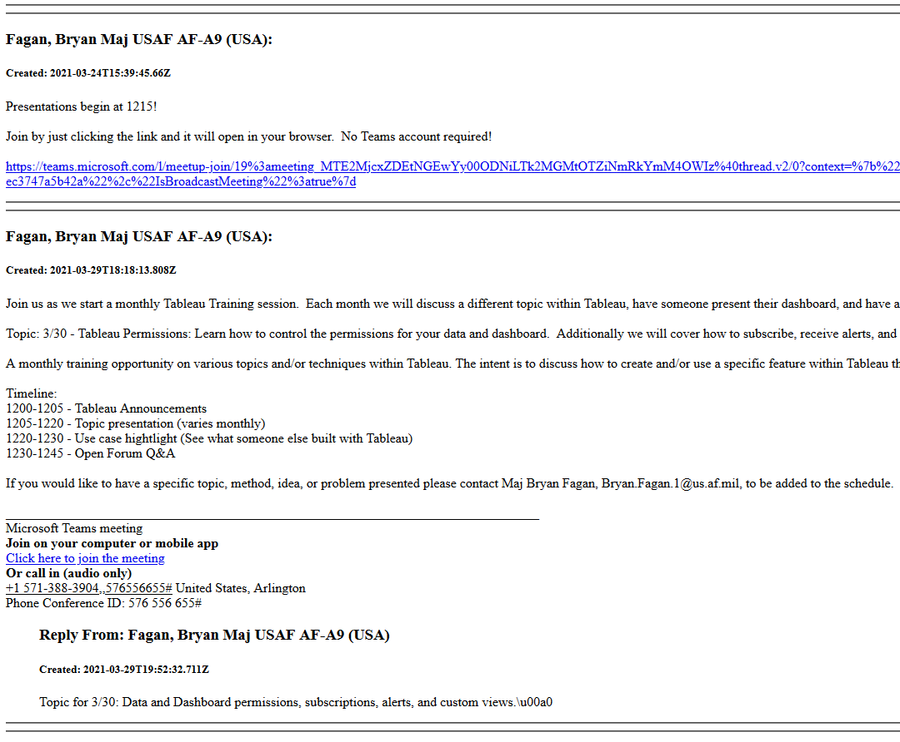

# Archive MS Teams Channel Messages
**Having problems running this to archive your CVR Teams messages? Drop me a note at stefan.fernandez.1@us.af.mil and I'd be happy to archive your channels (if you give me permissions to your Team).**

## Overview

This was written to support CVR Teams migration efforts. However, it should work on any Teams tenant that is accessible from the Microsoft Graph API.

This code uses the Microsoft Graph API to pull and output all messages (and replies) from a channel(s) in a Team. It outputs JSON and a parsed HTML version of the channel's messages. Here's an example of what the HTML output looks like:



### Prerequisites
- Python 3  
        -- Must have these packages installed: requests, datetime, yaspin, python-dateutil  
        ``` pip install requests datetime yaspin python-dateutil```

__NOTE: For those archiving from (DOD) CVR Teams, the data may include FOUO/CUI. Recommend only running this code from an appropriate computer.__

### Limitations

This script only works for 'Channel' messages. It does not work for regular 'Chat' messages, which may or may not be possible through the API. I did not investigate this.

## Instructions

### Step 0 - Get an User Auth Token

a) Navigate to https://developer.microsoft.com/en-us/graph/graph-explorer  
b) Sign in with your CVR Teams account  
c) Run any query  
d) Click the 'Access Token' tab and copy the token for later use.   


### Step 1 - Set up
- Git clone this repository or download ```archive_teams_messages.py``` to your working directory. 
- Open up a python 3 interactive session in the same working directory.
  
### Step 2 - List Groups and Channels
- In the python interactive session run the following to import the module:
```
from archive_teams_messages import *
```

Set your user auth token that you got from Step 0
```
setToken('super-long-auth-token-here')
```

Then run ```listMyTeams()``` to show Teams and Channels that you belong to. Example output below:
```
054cf813-27a2-4c24-98ae-03fad4c495ee   AF/A9A
        19:17492e041fe04a5489468f189a7bf98b@thread.skype   General
3055aa2d-b68d-4a8d-861c-0965de9ad15d   AF Analytic Community
        19:9dccd09179a7478e9a99cd527eec3326@thread.skype   General
        19:95d88ddbdf8949f4b7a3609db4cb5f4f@thread.skype   Crowdsourcing
        19:d896e259881847068b1e42532c21f395@thread.skype   AFAC (15A and 1515) Meetings
        19:26963956733b48398e8434fde7045ec5@thread.skype   Announcements
```
### Step 3 (Option A) - Download all messages from __all channels__
Run ```pullAllChannelMessagesInGroup("groupID")``` where ```groupID``` is the id from the previous step. 

Example for "AF Analytic Community" group:
```
pullAllChannelMessagesInGroup('3055aa2d-b68d-4a8d-861c-0965de9ad15d')
```

This will pull messages from all channels in that group and output ```.json``` and ```.html``` files for each channel in the current working directory.

### Step 3 (Option B) - Download all messages from a __single channel__
Run ```pullSingleChannelMessagesInGroup("groupID", "channelID")``` where ```groupID``` and ```channelID``` are the relevant ids from the previous step. 

Example for "General" channel of the "AF Analytic Community" group:
```
pullSingleChannelMessagesInGroup('3055aa2d-b68d-4a8d-861c-0965de9ad15d', '19:9dccd09179a7478e9a99cd527eec3326@thread.skype')
```

This will pull messages from that channel and output ```.json``` and ```.html``` files in the current working directory.
